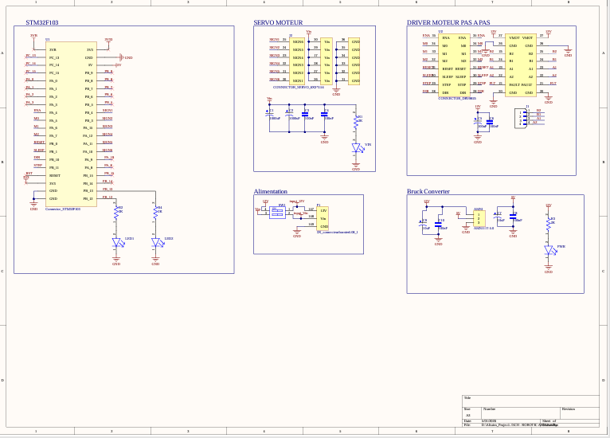
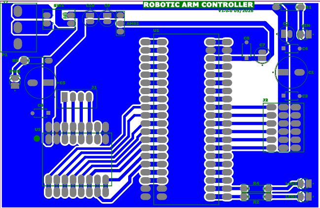
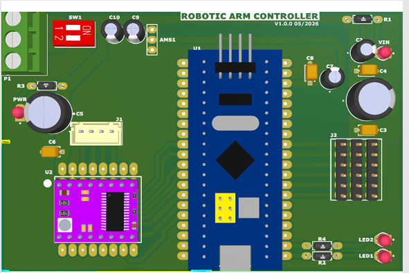

# robotic-arm-controller-v1

STM32-based robotic arm controller PCB designed in Altium Designer.

---

# Robotic Arm Controller V1

## Description
Conception d’une carte PCB de commande pour bras robotique réalisée sous Altium Designer.  
La carte est basée sur un microcontrôleur STM32F103 et permet le pilotage de moteurs pas à pas, servomoteurs et interfaces de communication.

---

## Architecture de la carte

La carte est organisée en plusieurs blocs fonctionnels :

### Microcontrôleur
- STM32F103 au centre de la carte  
- Gestion du contrôle global du système  
- Interfaces de communication : UART, I2C, SPI  

---

### Drivers moteurs pas à pas
- Emplacement pour drivers type A4988 / DRV8825  
- Tension moteur : 8V à 35V (selon driver utilisé)  
- Courant moteur : jusqu’à 2A par phase (avec refroidissement adapté)  
- Contrôle des moteurs pas à pas du bras robotique (type NEMA 17)

---

### Servomoteurs
- Connecteur dédié 6 canaux  
- Tension d’alimentation : 5V à 6V  
- Courant typique : 500 mA à 2.5 A par servo 
- Support de servomoteurs couple élevé type MG995

---

### Alimentation
- Alimentation logique : 3.3V (STM32F103)  
- Alimentation puissance séparée pour moteurs et servos  
- Distribution de puissance optimisée pour éviter les chutes de tension  

---

## Outils utilisés
- Altium Designer  
- Conception schématique et routage PCB  
- Génération des fichiers de fabrication  

---

## Contenu du projet
- Schématique électronique (PDF)  
- Layout PCB 2D  
- Vue 3D de la carte  
- Bill of Materials (BOM)  

---

## Aperçu du projet

### Schématique

### PCB 2D

### PCB 3D

---

## Objectif
Développer une carte de contrôle modulaire permettant la commande d’un bras robotique avec moteurs pas à pas et servomoteurs.
